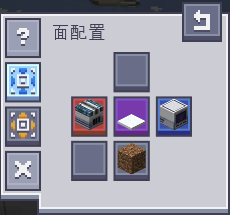

---
navigation:
  parent: index.md
  title: 机器的面配置
  icon: ae2cs:crystal_aggregator
  position: 50
---

# 机器的面配置

AECS 为大多数机器提供了一套统一的**面配置系统**，用于精确控制物品或资源在机器各个面的流向。

---

## 面配置界面

打开支持面配置的机器界面后，可以看到对应的面配置视图。
每一个方块面都可以被单独设置其行为，用于决定该面是否参与输入或输出。

---

## 面状态说明

在面配置界面中，不同颜色代表不同的面行为：

- **红色**：仅允许输入
- **蓝色**：仅允许输出
- **紫色**：允许输入与输出
- **灰色**：禁止输入与输出

无论面被如何配置，机器始终遵循以下规则：

- 输入槽位不会被物流管道输出
- 输出槽位不会被物流管道输入

---

## 主动模式控制

面配置界面右侧提供了三个控制按钮，用于调整机器的主动行为模式：

- **主动输入**
- **主动输出**
- **清空面配置**

当某一主动模式启用时，其对应按钮会保持高亮状态。

### 主动输入：

- 机器只会从**被允许输入的面**主动抽取资源

### 主动输出：

- 机器只会从**被允许输出的面**主动弹出产物

### 清空面配置：

- 清空操作会将所有面的状态重置为**禁用**状态，
用于快速恢复到未配置的初始行为。
